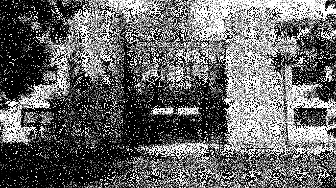

# TP Rust : Manipulations d'Images avec la Bibliothèque `image`

COURSIMAULT Irvyn - 31A

Ce projet a pour objectif de manipuler des images en utilisant la bibliothèque Rust `image` (version 0.24). Les traitements appliqués visent à transformer une image vers une version monochrome ou avec une palette réduite de couleurs.

## Installation et Pré-requis

1. Assurez-vous que `Rust` est installé sur votre machine. Si ce n'est pas le cas, installez-le en suivant les instructions sur rust-lang.org.
2. Clonez ce dépôt et installez les dépendances avec :
   
   ```bash
   cargo build
   ```

## Lancer l'application

Compiler et exécuter l'application avec :

```bash
cargo run
```

## Questions du TP - Partie 1

### Question 1

```
Créer un nouveau projet Cargo, avec une dépendance sur la bibliothèque image, version 0.24.
```

Pour commencer, un nouveau projet Cargo a été créé avec la commande suivante :

```bash
cargo new tp_image
cd tp_image
```

Ensuite, la dépendance `image` a été ajoutée dans le fichier `Cargo.toml` :

```toml
[dependencies]
image = "0.24"
```

### Question 2

```
Pour ouvrir une image depuis un fichier, on utilise ImageReader::open("myimage.png")?.decode()?; 
On obtient un DynamicImage, à quoi correspond ce type? Comment obtenir une image en mode rbg8 à partir de ce DynamicImage?

Indiquer les réponses dans votre README.
```

Lorsqu'on ouvre une image avec `ImageReader::open("myimage.png")?.decode()?`, on obtient un objet de type `DynamicImage`.
[Documentation de DynamicImage](https://docs.rs/image/latest/image/enum.DynamicImage.html)
Ce type est une enum qui représente différentes variantes d'images (par exemple, RGB8).\
Pour convertir une `DynamicImage` en mode RGB8, on utilise la méthode `to_rgb8()` :

```rust
let rgb_image = dynamic_image.to_rgb8();
```

### Question 3

```
Sauver l’image obtenue au format png. Que se passe-t-il si l’image de départ avait un canal alpha?
Expliquer dans le README de votre rendu ce qui se passe ici.
```

Pour sauvegarder une image transformée :

```rust
rgb_image.save("out.png")?;
```

#### Si l'image de départ possède un canal alpha

Si l'image d'entrée contient un canal alpha (transparence), celui-ci sera ignoré ou aplati (blendé avec une couleur de fond) lors de la conversion en mode RGB8. La transparence est remplacée par une couleur opaque par défaut.

### Question 4

```
Afficher dans le terminal la couleur du pixel (32, 52) de l’image de votre choix.
```

Voici un exemple de code pour afficher la couleur du pixel (32, 52) :

```rust
let pixel = rgb_image.get_pixel(32, 52);
println!("Couleur du pixel (32, 52) : {:?}", pixel);
```

### Question 5

```
Passer un pixel sur deux d’une image en blanc. Est-ce que l’image obtenue est reconnaissable?
```

Pour réaliser cette opération, on parcourt les pixels de l'image avec `enumerate_pixels_mut` et on modifie un pixel sur deux :

```rust
for (x, y, pixel) in rgb_image.enumerate_pixels_mut() {
    if (x + y) % 2 == 0 {
        *pixel = image::Rgb([255, 255, 255]); // Blanc
    }
}
```

#### Résultat visuel

L'image obtenue reste difficilement reconnaissable, car la moitié des pixels sont modifiés en blanc, ce qui réduit la quantité d'informations visuelles.


## Partie 2

### Question 6

```
Comment récupérer la luminosité d’un pixel?
```

La luminosité d’un pixel est généralement calculée à partir de ses composantes R (Rouge), G (Vert) et B (Bleu) en utilisant une formule pondérée basée sur la perception humaine. Selon la [recommandation UIT-R BT 601](https://fr.wikipedia.org/wiki/Luminance#Matri%C3%A7age), la luma est construite par :

```math
Luminosité = 0.299 × R + 0.587 × G + 0.114 × B
```

En Rust, pour un pixel donné (de type Rgb<u8>), cela peut être fait comme suit :

```rust
fn luminance(pixel: &image::Rgb<u8>) -> f32 {
    let [r, g, b] = pixel.0;
    0.299 * r as f32 + 0.587 * g as f32 + 0.114 * b as f32
}
```

### Question 7

```
Implémenter le traitement
```

Pour chaque pixel de l'image, on calcule la luminosité et on applique un seuil (ici, 50%). Si la luminosité est supérieure à 128 (sur 255), le pixel devient blanc (`Rgb([255, 255, 255])`), sinon il devient noir (`Rgb([0, 0, 0])`).

Voici un exemple d’implémentation :

```rust
use image::{ImageBuffer, Rgb, RgbImage};

fn threshold_to_monochrome(image: &RgbImage) -> RgbImage {
    let mut monochrome_image = image.clone();

    for pixel in monochrome_image.pixels_mut() {
        let lum = luminance(pixel);
        if lum > 128.0 {
            *pixel = Rgb([255, 255, 255]); // Blanc
        } else {
            *pixel = Rgb([0, 0, 0]); // Noir
        }
    }

    monochrome_image
}
```

Résultat :


---

### Question 8

```
Permettre à l’utilisateurice de remplacer "noir" et "blanc" par une paire de couleurs au choix.
```

Pour permettre à l’utilisateur de définir ses propres couleurs, il suffit de modifier la fonction précédente en prenant deux couleurs personnalisées (par exemple, `color1` et `color2`) comme paramètres.

```rust
fn threshold_to_custom_colors(image: &RgbImage, color1: Rgb<u8>, color2: Rgb<u8>) -> RgbImage {
    let mut custom_image = image.clone();

    for pixel in custom_image.pixels_mut() {
        let lum = luminance(pixel);
        if lum > 128.0 {
            *pixel = color2; // Couleur pour "blanc"
        } else {
            *pixel = color1; // Couleur pour "noir"
        }
    }

    custom_image
}
```

Résultat :


## Partie 3

### Question 9

```
Comment calculer la distance entre deux couleurs? Indiquer dans le README la méthode de
calcul choisie.
```

Pour calculer la distance entre deux couleurs, nous pouvons utiliser la distance Euclidienne dans l'espace RGB. Cette méthode permet de mesurer la similarité entre deux couleurs en traitant chaque composant RGB comme une coordonnée dans un espace tridimensionnel. La formule de la distance Euclidienne entre deux couleurs (R1, G1, B1) et (R2, G2, B2) est :

```math
Distance = √((R2 - R1)² + (G2 - G1)² + (B2 - B1)²)
```

Voici une fonction Rust pour calculer cette distance entre deux couleurs :

```rust
fn color_distance(c1: &Rgb<u8>, c2: &Rgb<u8>) -> f32 {
    let [r1, g1, b1] = c1.0;
    let [r2, g2, b2] = c2.0;

    let r_diff = (r2 as f32 - r1 as f32).powi(2);
    let g_diff = (g2 as f32 - g1 as f32).powi(2);
    let b_diff = (b2 as f32 - b1 as f32).powi(2);

    (r_diff + g_diff + b_diff).sqrt()
}
```

Cette fonction prend deux couleurs de type ```Rgb<u8>``` en entrée et renvoie la distance entre elles sous forme de ```f32```.

### Question 10

```
Implémenter le traitement
```

Pour appliquer une palette de couleurs, chaque pixel de l'image est remplacé par la couleur de la palette la plus proche, en utilisant la distance Euclidienne entre les couleurs. La fonction ```apply_palette``` parcourt chaque pixel de l'image et cherche la couleur la plus proche dans la palette fournie. Cela donne une image où chaque pixel est une approximation de la couleur la plus proche de la palette.

```rust
fn apply_palette(image: &RgbImage, palette: Vec<Rgb<u8>>) -> RgbImage {
    let mut palette_image = image.clone();

    for pixel in palette_image.pixels_mut() {
        let mut min_distance = f32::MAX;
        let mut closest_color = palette[0];

        for color in &palette {
            let distance = color_distance(pixel, color);
            if distance < min_distance {
                min_distance = distance;
                closest_color = *color;
            }
        }

        *pixel = closest_color;
    }

    palette_image
}
```

### Question 11

```
Votre application doit se comporter correctement si on donne une palette vide. Vous
expliquerez dans votre README le choix que vous avez fait dans ce cas.
```

Si une palette vide est fournie, j'ai choisi de renvoyer l'image inchangée et d'afficher un message d'erreur pour informer l'utilisateur que la palette est vide. Cela permet d'éviter des erreurs d'exécution ou des comportements indéfinis.


## Partie 4

### Question 12

```
Implémenter le tramage aléatoire des images
```

Le tramage aléatoire (ou dithering) consiste à appliquer un seuil aléatoire pour chaque pixel, ce qui donne un effet de bruit visuel tout en préservant un contraste et des détails plus fins que les simples transformations en monochrome ou en palette.

Pour implémenter le tramage aléatoire, nous allons procéder de la manière suivante :

1. Pour chaque pixel, on calcule sa luminosité.
2. Un seuil aléatoire est généré pour chaque pixel, compris dans une plage déterminée (par exemple, entre 0 et 255).
3. Si la luminosité d'un pixel est supérieure au seuil généré, le pixel est transformé en blanc ; sinon, il est transformé en noir.

Voici le code en Rust pour effectuer le tramage aléatoire :

```rust
fn random_dithering(image: &RgbImage) -> RgbImage {
    let mut rng = rand::thread_rng(); // Initialisation du générateur de nombres aléatoires
    let mut dithered_image = image.clone();

    for y in 0..image.height() {
        for x in 0..image.width() {
            let pixel = image.get_pixel(x, y);
            let lum = luminance(pixel); // Calcul de la luminosité du pixel
            let random_threshold: f32 = rng.gen_range(0.0..255.0); // Seuil aléatoire

            // Application du seuil pour déterminer la couleur du pixel
            dithered_image.put_pixel(
                x,
                y,
                if lum > random_threshold {
                    Rgb([255, 255, 255])
                } else {
                    Rgb([0, 0, 0])
                },
            );
        }
    }

    dithered_image
}
```

Résultat :

